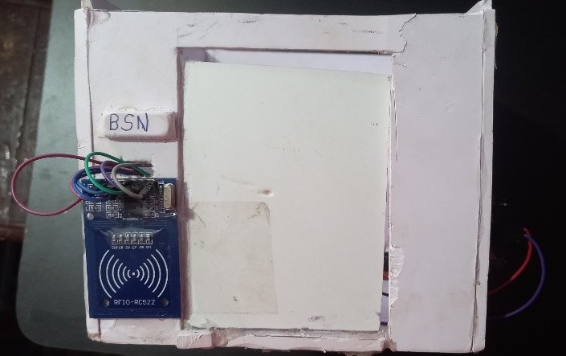
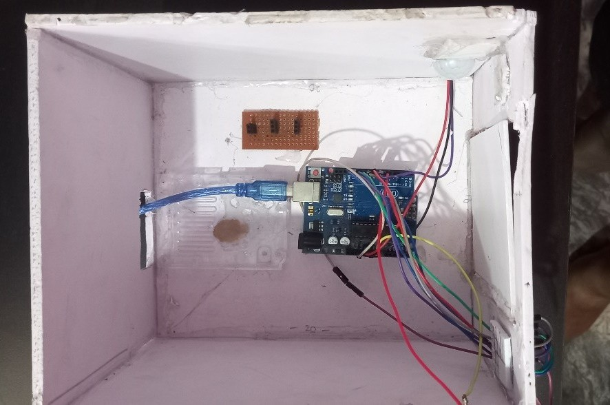

# 🚨 IoT Mini Security System

A simple yet effective IoT-based security system using RFID, PIR sensor, and buzzer. This project detects unauthorized access and motion, providing real-time alerts.

---

## 📸 Demo & Media

### System Overview

### Hardware Setup

---

## 🛠️ Features

- **RFID Authentication:** Only authorized RFID cards can disable the alarm.
- **Motion Detection:** PIR sensor detects movement and triggers the buzzer if unauthorized.
- **Real-Time Alerts:** Serial monitor outputs for all events.
- **Easy Reset:** System resets after each motion event.

---

## 📋 How It Works

1. **Startup:** System initializes and waits for the PIR sensor to stabilize.
2. **RFID Scan:** Present your RFID card. If authorized, the system allows motion without triggering the buzzer.
3. **Motion Detection:** If motion is detected without authorization, the buzzer sounds an alert.
4. **Reset:** After motion ends, the system resets and waits for the next event.

---

## 🧰 Hardware Required

- Arduino Board
- MFRC522 RFID Module
- PIR Motion Sensor
- Buzzer
- Jumper Wires

---

## 💻 Code

See [`iot.txt`](iot.txt) for the complete Arduino code.

---

## 📂 Media

- Images and video are available in the [`github/`](github/) folder.

---

## 📞 Contact

For questions or suggestions, feel free to open an issue or contact the project maintainer.

---